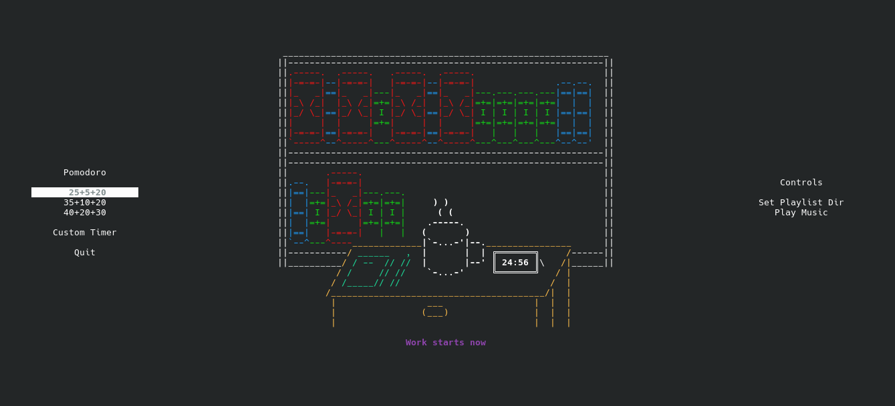

# STACKODORO-CLI

A cozy Pomodoro terminal cli app. For every work session you complete, a random book is added to your bookshelf.



## Features
- Built entirely for the terminal using urwid.
- **Integrated music player**: Pick the local directory of your playlist, play/pause music, skip tracks, and adjust the volume directly within the TUI.
- **Customizable Timers:**: Set your own durations for work, break, and long break sessions.
- **Audio Cues**: Automatically pauses your music and plays a transition sound when a session finishes. Music resumes when you start your next work session.
- **Persistent State**: Your bookshelf progress, completed shelves, and last used playlist directory are automatically saved to `~/.local/share/stackodoro-cli/stackaro.json` (or `$XDG_DATA_HOME/stackodoro-cli/stackaro.json` if set).

## Dependencies

This project requires **pipx** to install. If you don't have it yet:
```bash
# Linux 
python3 -m pip install --user pipx
python3 -m pipx ensurepath
```

> For more details, see the [official pipx installation guide](https://pipx.pypa.io/stable/installation/).

## Building from Source

```bash
git clone https://github.com/PauloFRC/stackodoro-cli
cd stackodoro-cli
pipx install -e --force .
```

## Running

Once installed, you can launch the app from anywhere in your terminal:

`stackodoro`

## Controls

| Key | Action |
|-----|--------|
| <kbd>Space</kbd> | Start / Pause Timer / Confirm Session Transition |
| <kbd>+</kbd> / <kbd>=</kbd> | Increase Music Volume |
| <kbd>-</kbd> / <kbd>_</kbd> | Decrease Music Volume |
| <kbd>Esc</kbd> | Close open dialog menus |
| <kbd>q</kbd> / <kbd>Q</kbd> | Save and Quit Application |
